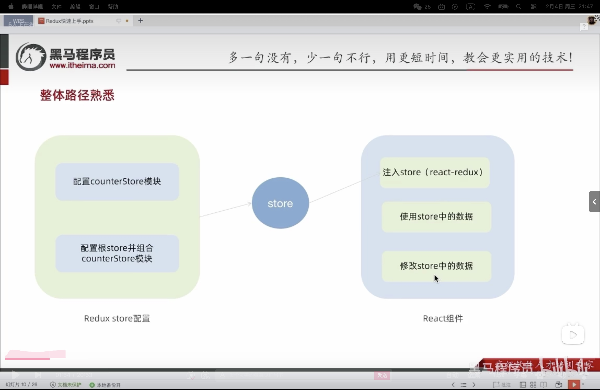

# REACT


## DAY-1

REACT是用于构建Web和原生交互页面的库


执行上方命令创建一个react项目

[https://zh-hans.react.dev/learn/start-a-new-react-project]()

### 1.`JSX`

#### 1.简介

`JSX` 是 `JavaScript` 和 `XHL(HTML)` 的缩写，表示在`JS` 代码中编写`HTML` 模板结构，是`REACT` 中编写 `UI` 模板的方式；在标准浏览器中不能识别，这属于JS语法扩展，需要解析工具做解析之后才能在浏览器中运行


优势：HTML的声明式模板写法，JS可编程能力

#### 2.高频场景

在JSX中使用{}就可以编辑JS代码

```jsx
    <div className="App">
      this is App;
      {/*使用引号传递字符串 */}
      {"this is message"}
      {/*识别js变量 */}
      {count}
      {"函数调用"}
      {getName()}
      {"方法调用"}
      {new Date().getDate()}
      {/*使用js对象,{}外层是识别JSX内容的，内层识别对象调用*/}
      <div style={{ color: "red" }}>this is div</div>
    </div>
```

**列表渲染**

```js
const list = [
  { id: 1001, name: "Vue" },
  { id: 1002, name: "React" },
  { id: 1003, name: "Angular" },
];
function App() {
  return (
    <div className="App">
      {/*渲染列表 */}
      <ul>
        {list.map((item) => (
          <li key={item.id}>{item.name}</li>
        ))}
      </ul>
    </div>
  );
}
export default App;
```

li标签中的key是REACT语言中的标识字段，用来提升列表的更新性能，要求是字符串或者num，开发中基本都是使用id，与我们没有太大关系

**条件渲染**（true或flase对应不同渲染）

在REACT中，可以通过逻辑与运算符，三元表达式实现基础的条件渲染

```js
const isLogin = true;
function App() {
  return (
    <div className="App">
      {/*逻辑&& */}
      {isLogin && <span>this is span</span>}
      {/*三元运算 */}
      {isLogin ? <span>jack</span> : <span>loading...</span>}
    </div>
  );
}

export default App;
```

**复杂条件渲染**

```js
const articleType = 1; //0,1,3
function getArticleTem() {
  if (articleType === 0) {
    return <div>我是无图文章</div>;
  } else if (articleType === 1) {
    return <div>我是单图模式</div>;
  } else {
    return <div>我是三图模式</div>;
  }
}
function App() {
  return (
    <div className="App">
      {/*调用函数渲染不同的模板 */}
      {getArticleTem()}
    </div>
  );
}

export default App;
```

### 2.REACT中的事件绑定

语法：on + 事件名称 = {事件处理程序}；

```js
function App() {
  const handleClick = () => {
    console.log("button被点击了");
  };
  //传递自定义参数
  const hd = (name) => {
    console.log("hd", name);
  };
  //传递自定义参数＋事件对象
  const hdcms = (name, e) => {
    console.log(name, e);
  };
  return (
    <div className="App">
      <button onclick={handleClick}>click me</button>
      <button onClick={() => hd("jack")}>hd</button>
      <button onClick={(e) => hdcms("hdcms", e)}>hdcms</button>
    </div>
  );
}

export default App;

```

#### 1.REACT组件

一个组件就是用户界面的一部分，它可以有自己的逻辑和外观，组件之间可以相互嵌套，也可以复用多次


在REACT中，一个组件就是首字母大写的函数，内部存放了组件的逻辑和视图UI，渲染组件只需要把**组件当成标签**书写即可，


```js
function Button() {
//const Button = ()=>{  //用箭头函数也可以
  //业务逻辑组件逻辑
  return <button>click me!</button>;
}
function App() {
  return (
    <div className="App">
      {/*渲染组件 */}
      {/*自闭合 */}
      <Button />
      {/*成对标签 */}
      <Button></Button>
    </div>
  );
}

export default App;

```

### 3.useState基础使用

> [!NOTE]
>
> 我可以使用`useState`获得两样东西：当前的`state(count)` ,以及用于更新他的函数`setCount()`；这其实就是需要 “它” 现在 “记住” 一个当前状态，并通过固定的方法改变状态；

useState是一个React Hook函数，它允许我们向组件添加一个状态变量，从而控制影响组件的渲染结果

本质：状态变量一旦发生变化，组件的视图UI也会跟着变化**（数据驱动视图）**


```js
//yseState实现一个计数器按钮
import { useState } from "react";
function App() {
  //1.调用useState添加一个状态变量
  //count状态变量
  //setCount 修改状态变量的方法
  const [count, setCount] = useState(0);

  //2.点击事件回调
  const handleClick = () => {
    //作用：1.用传入的新值修改count  2.重新使用新的count渲染UI
    setCount(count + 1);
  };
  return (
    <div className="App">
      <button onClick={handleClick}>{count}</button>
    </div>
  );
}

export default App;
```

#### 1.修改状态的规则

在REACT中，状态被认为是只读的，我们应该始终替换他而不是修改它，直接修改状态不会引发视图更新

对于对象类型的状态变量，应该始终传给set方法一个全新的对象来进行修改

> [!WARNING]
>
> ##### 核心规则一：必须使用“设置函数”更新状态
>
> 这是最重要的规则。你不能直接修改状态变量，而必须调用 `useState`返回的**设置函数**。
>
> ##### 核心规则二：状态是不可变的
>
> 当状态是**对象**或**数组**时，你必须创建一个新的对象或数组，而不是修改当前的那个。
>
> 总结：其实就是修改set...的函数才起作用

```js
import { useState } from "react";
function App() {
  const [count, setCount] = useState(0);

  const handleClick = () => {
    //直接修改无法引发视图更新
    // count++
    //作用：1.用传入的新值修改count  2.重新使用新的count渲染UI
    //需要重新调用
    setCount(count + 1);
  };

  //修改对象状态
  const [form, setForm] = useState({ name: "'jack" });
  const changeForm = () => {
    //错误写法
    // form.name = 'join';
    //正确方法
    setForm({
      ...form,
      name: "join",
    });
  };
  return (
    <div className="App">
      <button onClick={handleClick}>{count}</button>
      <button onClick={changeForm}>修改form{form.name}</button>
    </div>
  );
}

export default App;
```

#### 2.组建的样式处理

1.行内样式  

2.class类名控制

```js
//导入样式
import "./index.css";
const style = {
  color: "red",
  fontsize: "50px",
};
function App() {
  return (
    <div className="App">
      {/*行内样式 */}
      {/*<span style={{ color: "red", fontsize: "50px" }}>this is a span</span>*/}
      <span style={style}>this is a span</span>

      {/*通过类名控制 */}
      <span className="foo">this ia a class foo</span>
    </div>
  );
}

export default App;
```

## DAY-2

### 1.受控表单绑定

就是使用REACT组件的状态来控制表单的状态


```js
//1.声明一个REACT状态 - useState
import {useState} from "react"

//核心绑定流程
//通过value属性绑定状态值
//通过onChange事件绑定状态更新函数，通过事件参数e拿到输入框的最新值，反向修改到REACT状态
function App() {
  const [value,setValue] = useState('')
  return (
    <div>
      <input
      value = {value}
      onChange = {(e)=>setValue(e.target.value)}
      type="text"/>
    </div>
  );
}

export default App;
```

### 2.REACT中获取DOM

在REACT组件中获取/操作DOM，需要使用useRef钩子函数，分为两步：

```js
//项目的根组件：被引入index.js，在public/index.html中渲染

//REACT中获取DOM
import {useRef} from 'react'
//1.使用useRef创建ref对象，并与JSX绑定
//2.在DOM可用时，通过inputRef.current拿到DOM对象
//渲染完毕之后 dom生成之后才可用

function App() {
  const inputRef=useRef(null)
  const showDom = ()=>{
    console.log(inputRef.current) //这里就是通过inputERef.current拿到DOM对象
  }
  return (
    <div className="App">
      <input type="text" ref={inputRef}></input>
      <button onClick={showDom}>获取DOM</button>
    </div>
  );
}

export default App;
```

### 3.组件通信

组件通信就是组件之间的数据传递，根据组件嵌套关系的不同，有不同的通信方法

以 `use` 开头的函数被称为 **Hook**。Hook 比普通函数更为严格。你只能在你的组件（或其他 Hook）的 **顶层** 调用 Hook。

#### 1.父传子

1.父组件传递数据：在子组件标签上绑定属性

2.子组件接收数据：子组件通过props参数接收数据

```js
//父传子

//1.父组件传递数据：在子组件标签上绑定属性
//2.子组件接收数据：子组件通过props参数接收数据
function Son(props) {
  //props:对象，里面包含了父组件传递过来的所有数据
  return <div>this is son ,{props.name}</div>
}
function App() {
  const name = 'this is a app name'
return (
    <div>
    <Son name = {name}/>
  </div>
)
}

export default App;
```

> [!NOTE]
>
> 1.props可以传递任何数据
>
> 2.props是只读属性，也就是说这个传递过来的参数只能在父组件中进行修改

**特殊的prop children**

当我们把内容嵌套在子组件标签中的时候，父组件会在名为children的prop属性中接收该内容

```js
//父传子

//1.父组件传递数据：在子组件标签上绑定属性
//2.子组件接收数据：子组件通过props参数接收数据
function Son(props) {
  console.log(props);
  //props:对象，里面包含了父组件传递过来的所有数据
  return <div>this is son,{props.children}</div> 
   //也就是说，在<Son></Son>中间的内容就是props.children
}
function App() {

return (
    <div>
    <Son>
      <span>this is span</span>
    </Son>
  </div>
)
}

export default App;
```


#### 2.子传父

核心思路是：在子组件中调用父组件的函数并传递实参

```js
import {useState} from "react"

//子传父
//1.在父组件中将函数同步到子组件
//2.在子组件中使用onclick和同步过来的函数传参
function Son({onGetMsg}) {
  const sonMsg = 'this is son massage'
  return (
    <div>this is Son
      <button onClick={()=>onGetMsg(sonMsg)}>点击</button>
    </div>
  )
}
function App() {
  const [msg,setMsg]=useState('')  
  //由于我想把子组件传递过来的数据渲染到页面中，所以需要添加状态变量（数据驱动视图）
const getMsg = (msg)=>{
  console.log(msg);
  setMsg(msg)
}
return (
    <div>
      this is App,{msg}
      <Son onGetMsg = {getMsg}/>
  </div>
)
}

export default App;
```

#### 3.兄弟组件通信

使用状态提升实现兄弟组件通信，借助父组件

```js
import {useState} from "react"

//实现兄弟组件通信
//1.子传父：A->App
//2.父传子：App->B
function A({onGetAName}) {
const name = 'this is A name'
  return(
    <div>this is A
    <button onClick={()=>{onGetAName(name)}}>send</button>
    </div>
  )
}
function B({name}) {
  return (
  <div>this is B
    {name}
  </div>
  )
}
function App() {
  const [name,setName]=useState('')
  const getAName=(name)=>{
    console.log(name);
    setName(name)
  }
return (
    <div>
      this is App
      <A onGetAName={getAName}/>
      <B name={name}/>
  </div>
)
}

export default App;
```

#### 4.使用Context机制跨越组件通信

```js
//App->A->B  现在实现B使用App提供的数据
import {createContext,useContext} from "react"
//1.使用createContext方法创建上下文对象
const MsgContent=createContext()
//2.在顶层组件中，使用Provider组件提供数据
//3.在底层组件中，通过useContext钩子函数使用数据
function A() {
  return(
    <div>
      this is A
      <B/>
    </div>
  )
}
function B() {
  const msg = useContext(MsgContent)
  return (
    <div>
      this is B
      {msg}
    </div>
  )
}
function App() {
  const msg="this is app msg"
  return (
    <div>
      <MsgContent.Provider value={msg}>
      this is App
      <A/>
      </MsgContent.Provider>
    </div>
  )
}
export default App 
```

### 4.useEffect

用于在React组件中创建不是由事件引起而是由渲染本身引起的操作，比如发送AJAX请求，更改DOM等

```js
useEffect(()=>{},[])
//参数1：副作用函数，在函数内部可以放置需要执行的操作
//参数2：数组（可选参），在数组里放置依赖项，不同依赖项会影响第一个函数的执行，当是一个空数组的时候副作用函数只会在组件渲染完成后执行一次
//接口地址：http://geek.itheima.net/v1_0/channels
```

```js
import {useEffect,useState} from "react"
const URL="http://geek.itheima.net/v1_0/channels"
function App() {
  //创建状态
  const [list,setList]=useState([])
  useEffect(()=>{
    //额外的操作：获取频道列表
    async function getList(){
      const res= await fetch(URL)
      const jsonRes = await res.json()
      console.log(jsonRes);
      setList(jsonRes.data.channels)
    }
    getList();
  },[])
  return (
    <div>
      this is App
      <ul>
        {list.map(item=><li key={item.id}>{item.name}</li>)}
      </ul>
    </div>
  )
} 
export default App
```
传入依赖项：
1.没有依赖项：组件初始渲染+组建更新时执行
2.空数组依赖：只在初始渲染时执行一次
3.添加特定依赖项：组件初始渲染+特定依赖项变化时执行
```js
import {useState,useEffect} from "react"
//1.没有依赖项的副作用函数
//2.空数组依赖：只在初始渲染时执行一次
function App() {
  const [count,setCount]=useState(0)
  useEffect(()=>{
    console.log('副作用函数被执行')
  })
  return (
    <div>
      this is App
      <button onClick={()=>setCount(count+1)}>{+count}</button>
    </div>
  );

  //3.有依赖项的副作用函数
  //   const [count,setCount]=useState(0)
  // useEffect(()=>{
  //   console.log('副作用函数被执行')
  // },[count])
  // return(
  //   <div>
  //     this is App2
  //     <button onClick={()=>setCount(count+1)}>+{count}</button>
  //   </div>
  // )
}

export default App;
```
清除副作用操作：
最常见的时机是在组件卸载时进行清除
```js
 import {useState,useEffect} from 'react'
 function Son() {
  //1.在渲染时创建一个定时器
  useEffect (()=>{
    const timer=setInterval(() =>{
      console.log('定时器执行中...')
    })
    //清除副作用
    return()=>{
      clearInterval(timer)
    }
  })
  return(
    <div>
      this is Son
    </div>
  )
 }
 function App() {
    const [show,setShow]=useState(true)
    return(
      <div>
        {show && <Son/>}
        //点击后状态变为false，Son组件被卸载
        <button onClick={()=>setShow(false)}>卸载Son</button>
      </div>
    )
 }
```
###5.自定义Hook函数
自定义Hook就是以use打头的函数，通过自定义Hook函数可以实现逻辑的封装和复用
```js
//自定义Hook
//1.声明一个use函数
//2.在函数体中封装可复用的逻辑
//3.把需要用的状态和回调函数return出去
//4.在其他组件中引入并调用自定义Hook
import {useState} from 'react'

function useToggle(){
  //可复用的
    const [value,setValue]=useState(true)
    const toggle=()=>setValue(!value)
    //哪些状态和回调函数需要在其他组件中使用，就return出去
    return [value,toggle]
}
function App() {
  const [value,toggle]=useToggle()
  //创建一个状态数据
  return(
    <div>
      {value &&<div>this is div </div>}
      <button onClick={toggle}>toggle</button>
    </div>
  )
} 
export default App;
```
使用规则：
1.只能在Hook组件内使用
2.只能在组件的顶层使用，不能嵌套在if，for等内部嵌套使用
### 5.优化需求
使用json-server工具模拟接口服务，通过axios发送接口请求，json-server是一个快速以.json文件作为数据源模拟接口服务的工具
## DAY-3
### 1.Redux介绍
Redux是react最常用的集中状态管理工具，可以独立于框架运行，是为了通过集中管理的方式管理应用的状态
使用步骤：
1.定义一个reducer函数（根据目前想要做的修改返回一个新的状态）
2.使用createStore方法传入reducer函数，生成一个store实例对象
3.使用store实例的subscribe方法订阅数据的变化（数据一旦变化，可以得到通知）
4.使用store实例的dispatch方法提交action对象，触发数据变化（也就是告诉reducer我想怎么改变数据）
5.使用store实例的getState方法获取最新的状态数据更新到视图中
  ```js
      <script>
        //1.定义reducer函数
        //作用：根据不同的action对象，返回不同的新state
        //store：管理数据的初始状态
        //action：对象type属性，描述要做什么操作
        function reducer(state={count:0},action) {
            if(action.type==='INCREMENT') {
                return {count:state.count+1}
            }
            if(action.type==='DECREMENT') {
                return {count:state.count-1}
            }
            return state //都不满足的话就返回之前的状态
        }
        //2.使用reducer函数生成store实例
        const store=Redux.createStore(reducer)
        //3.通过store实例的subscribe方法监听state的变化
        //回调函数可以在每次
        store.subscribe(()=>{
            console.log('state变化了')
            document.getElementById('count').innerText=store.getState().count
        })
        //4.通过store实例的dispatch函数提交action更改状态
        const inBtn=document.getElementById('increment')
        inBtn.addEventListener('click',()=>{
            store.dispatch({
                type:'INCREMENT'
            })
        })
        const deBtn=document.getElementById('decrement')
        deBtn.addEventListener('click',()=>{
            store.dispatch({
                type:'DECREMENT'
            })
        })
        //5.通过store实例的getState方法获取最新的state并渲染到视图中

    </script>
  ```
  **三个核心概念**
  1.store：对象，存放我们管理的状态state
  2.action：对象，用户的操作，也就是用来描述我怎么修改数据
  3.reducer：函数，根据action的描述来生成一个新的state
###  2.Redux与react配合使用
1.使用cra创建react项目
2.安装配套工具
```
npm i @reduxjs/toolkit react-redux
```
3.启动项目
```
npm run start
```

